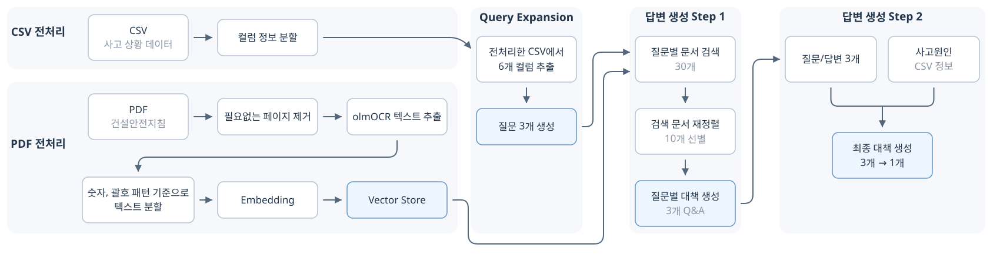
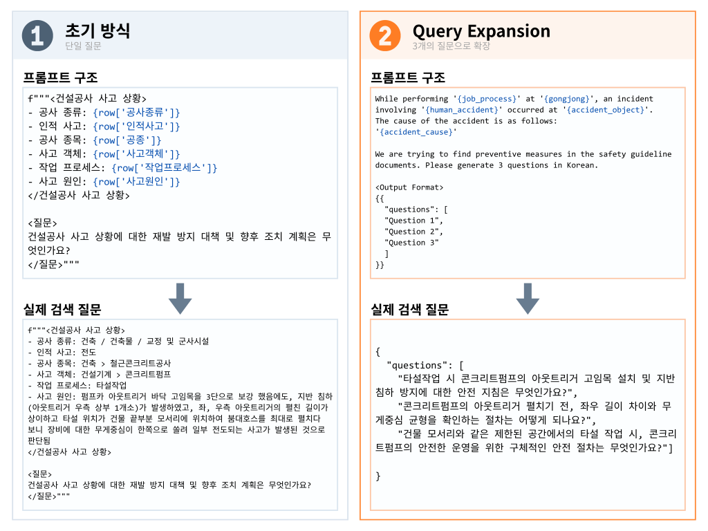
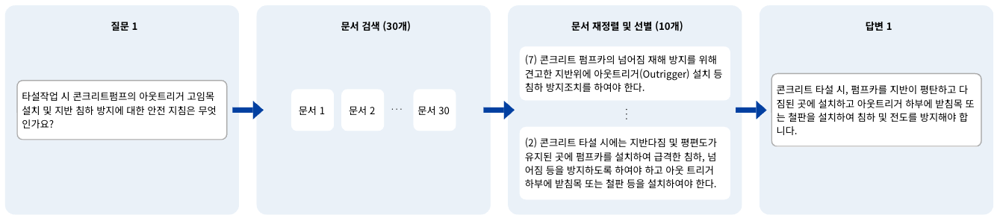
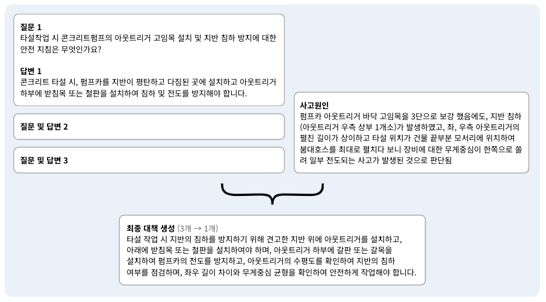

# 건설공사 사고 예방 대책 생성

포트폴리오 항목별 상세 내용 바로가기

| 포트폴리오 제목 | README 위치 |
|---|---|
| 전체 흐름 | [전체 파이프라인](#전체-파이프라인) (이미지만) |
| 초기 접근의 한계 | [문제 정의](#️-문제-정의) |
| 핵심 구현 1. PDF 전처리 및 구조 기반 분할 | [구현 1](#️-핵심-구현-1-pdf-전처리-및-구조-기반-분할) |
| 핵심 구현 2. Query Expansion으로 질문 확장 | [구현 2](#️-핵심-구현-2-query-expansion으로-질문-확장) |
| 핵심 구현 3. 2단계 답변 생성 | [구현 3](#️-핵심-구현-3-2단계-답변-생성) |

---

<br>사고 상황을 바탕으로 재발 방지 대책을 생성하는 경진대회입니다.
<br>검색 질문 3개를 만들어 질문별로 건설안전지침을 검색하고 각 답변을 생성한 후, 하나의 최종 대책으로 통합했습니다.

대회 평가 기준에 따라, 수상자를 선별하기 위한 최종 평가는 참가를 희망한 팀으로만 한정되었습니다. 24팀 중 7위를 달성했습니다.

| 항목 | 내용 |
|---|---|
| 경진대회 | [건설공사 사고 예방 및 대응책 생성: 한솔데코 시즌3 생성 AI 경진대회](https://dacon.io/competitions/official/236455/overview/description) |
| 기간 | 2025.02 - 2025.03 |
| 참여 인원 | 2명 |
| 담당 역할 | 데이터 전처리 및 PDF 텍스트 추출<br>Query Expansion 및 2단계 답변 생성<br>발표 자료 제작 |
| 2차 평가 결과 | 7위/24팀 (75.1점) |
| 발표 자료 | [구글 드라이브 공유 링크](https://drive.google.com/file/d/1qy_XuKnfRBbYql8FOTz5hs0mj8JxNDik/view?usp=sharing) |

<br>

## ⭐️ 문제 정의

본 경진대회는 사고 상황을 바탕으로 재발 방지 대책을 생성해야 합니다. \
입력으로는 질문 형태가 아니라 작업프로세스, 사고원인 등 사고 상황이 기록된 CSV로 주어졌습니다. \
이 데이터를 질문으로 구성하고 답변의 근거 자료를 선택하는 과정에서 다음과 같이 접근을 바꿨습니다.

- **초기 방식**: 사고 상황 데이터의 조합을 질문으로 사용하고, train의 `재발방지대책 및 향후조치계획` 을 검색 문서로 사용
- **한계**: 기존 대책을 새로운 사고 상황에 끼워맞추게 되는 방식이었고, 이것만으로는 구체적인 대책을 제시하는데 한계가 있다고 판단
- **방향 전환**: 검색 문서로 건설안전지침 PDF를 사용하기로 결정했고, 질문과의 관련성을 높이기 위해 사고 상황을 새로운 질문으로 확장

<br>

## 전체 파이프라인



<br>

### CSV 전처리

- 사고 상황의 세부 정보를 질문 생성에 활용하기 위해 특정 컬럼 값을 분리
- `(`, `>` 등 구분자를 기준으로 분리

| 원본 컬럼 | 분리 전 | 분리 후 | 생성 컬럼 |
|---|---|---|---|
| 공종 | 건축 > 철근콘크리트공사 | 철근콘크리트공사 | 공종2 |
| 사고객체 | 건설기계 > 콘크리트펌프 | 건설기계<br>콘크리트펌프 | 사고객체1<br>사고객체2 |
| 인적사고 | 떨어짐(5미터 이상 ~ 10미터 미만) | 떨어짐 | 인적사고1 |

<br>

### ⭐️ 핵심 구현 1. PDF 전처리 및 구조 기반 분할

건설안전지침 PDF 104개를 다음과 같이 처리했습니다.

- 표지, 목차 제거: 7개 문서는 앞 3페이지를, 그 외 문서는 앞 2페이지를 제거
- 텍스트 추출: olmOCR로 페이지별 텍스트 추출
- 텍스트 분할: 문서 구조 패턴을 정규표현식으로 지정하여 분할
    - 숫자 패턴: `r"^((?:[1-9]\d*\.)+(?:[1-9]\d*)?)\s+([A-Z가-힣].*?)$"` → 1., 1.1, 1.1.1
    - 괄호 숫자 패턴: `r"^\((\d+)\)\s+([A-Z가-힣].*?)$"` → (1), (2)
    - 괄호 한글 패턴: `r"^\s*\(([\uac00-\ud7a3])\)\s+(.+?)$"` → (가), (나)

```json
{
    "page_content": "(7) 콘크리트 펌프카의 넘어짐 재해 방지를 위해 견고한 지반위에 아웃트리거(Outrigger) 설치 등 침하 방지조치를 하여야 한다.", 
    "metadata": {
        "id": "10.-(7)",
        ...
        "breadcrumb": "10. 콘크리트 타설 > (7) 콘크리트 펌프카의 넘어짐 재해 방지를 위해 견고한 지반위에 아웃트리거(Outrigger) 설치 등 침하 방지조치를 하여야 한다.",
        ...
        "file_name": "교량공사(라멘교) 안전보건작업지침"
    }
}
```

<br>

### ⭐️ 핵심 구현 2. Query Expansion으로 질문 확장

건설안전지침 검색에 사용할 질문이 필요했고, 사고 상황을 3개의 질문으로 확장했습니다.

- 입력 컬럼: 사고 상황 데이터의 6개 컬럼 사용
    - `공종2`, `작업프로세스`, `사고객체1`, `사고객체2`, `인적사고1`,
      `사고원인`

- 프롬프트 주요 조건
    - 사고 상황을 바탕으로 안전지침 문서에서 예방 대책을 찾기 위한 질문 생성
    - 한 질문에서 여러 상황을 동시에 묻는 복합 질문은 피하도록 함
    - 한국어로 질문 3개를 JSON 형식으로 출력

    <br>
    

<br>

### ⭐️ 핵심 구현 3. 2단계 답변 생성

질문별로 검색한 건설안전지침을 바탕으로 각각의 대책을 생성하고, 이를 하나의 대책으로 통합했습니다.

### Step 1: 질문별 대책 생성

- 질문별로 문서 30개 검색 후, 재정렬하여 10개 선별
- 질문과 선별된 문서 본문을 입력하여, 문서의 핵심 내용을 통합하고 하나의 문장으로 답하도록 요청

질문 3개 중 1개의 처리 예시입니다.


### Step 2: 최종 대책 생성

- 3개의 질문 및 답변과 사고원인 컬럼을 함께 입력했고, 주요 조치를 하나의 문장으로 통합하도록 요청


